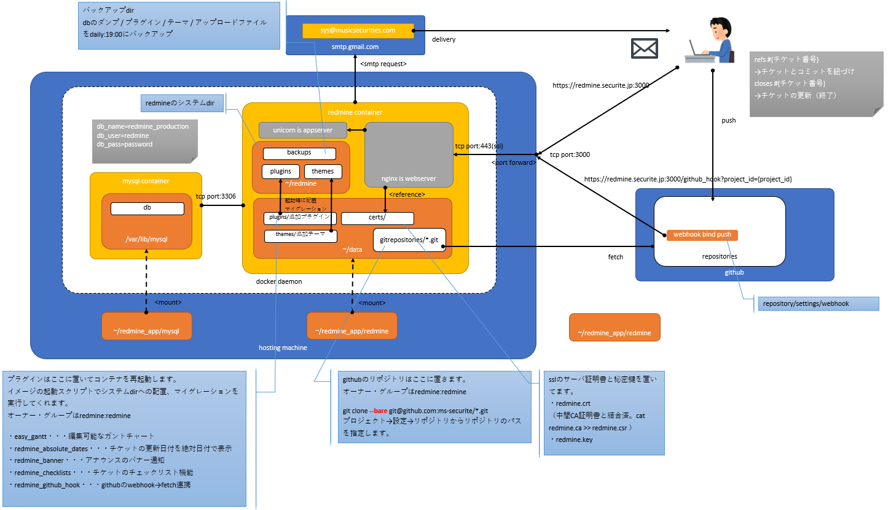

# redmine on docker 構築メモ #
## アーキテクト
---
> 

## 運用 ##
---

### コンテナの入り方
---
```
docker ps
→ dockerプロセス一覧
docker exec -it {[コンテナID|コンテナ名]} /bin/bash
```

### プラグインを入れる ###
---

  メンテナンスはコンテナ内に入ってredmineユーザで作業する。  
  インストール方法はプラグインの各ディストリビュータのマニュアルを参照する。   
  基本的にはプラグインの配置場所にgitホストからcloneするパターンが多い。  
  コンテナを再起動すると、コンテナのプロビジョニングがDBのマイグレーションまでやってくれるので、メンテフリー。


> プラグインの配置場所
```
/home/redmine/data/plugins
```

***コンテナの中でAPPサーバを再起動してもロードされるわけではないので注意***

あくまでコンテナのプロビジョニングがプラグインをインストールするため、APPサーバーを再起動しても何も起こらない。
```
# redmine(アプリケーションサーバ)の再起動
supervisorctl restart unicorn
→APサーバーの再起動ではプラグインはプロビジョニングがされない。
```

### トラブルシューティング ###
---
#### メールが送信されない ####
---
管理者権限で [管理/設定/メール通知]テスト送信で今一度送信してみる。

redmineコンテナに入って以下のconfigを確認し、
smtpまわりに問題がないか確認する。
たとえば、メールサーバーやアカウント情報変わったとか

```
docker ps
→{コンテナid}

docker exec -it {コンテナid} bash
cat /home/redmine/redmine/config/configuration.yaml

default:
  email_delivery:
    delivery_method: :async_smtp
    async_smtp_settings:
      enable_starttls_auto: true
      address: {smtpサーバー} 
      port: {TCPポート}
      domain: {smtpサーバー} 
      authentication: :login
      user_name: {SMTP認証ユーザ}
      password: {SMTP認証パスワード}
      tls: false
```

本来は
/home/ec2-user/redmine_app/docker-compose.ymlに定義した環境変数が
再起動時にdockerにフィードバックされるはずなんだけどなぜかされない。

#### コンテナが立ち上がらない ####
---
プラグインのインストールミスやその他コンテナ内でエラーが発生するとコンテナが起動失敗する。こうなるとコンテナを再起動とかしても無理なので原因調査する。

エラー確認のオペレーションは下記の通り。

```
# コンテナプロセスの一覧から{ STATUS } が{ exited }（落ちてる）の{ CONTAINER ID }を確認する。
docker ps -a

# コンテナの標準出力、標準エラーをログで確認する。
docker logs { CONTAINER ID }

プラグインのバージョンが合わないとか、だいたいそんな感じのエラーなので、
プラグインの場合だと、導入したプラグインを削除して再起動する。
```