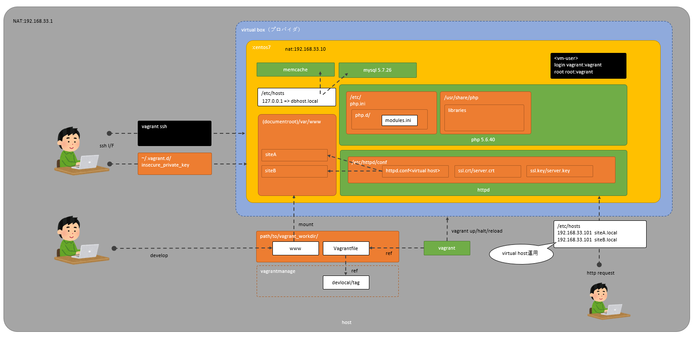
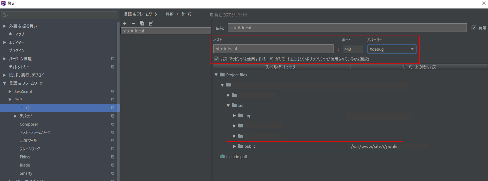
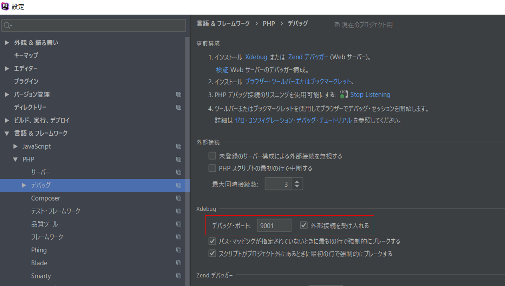
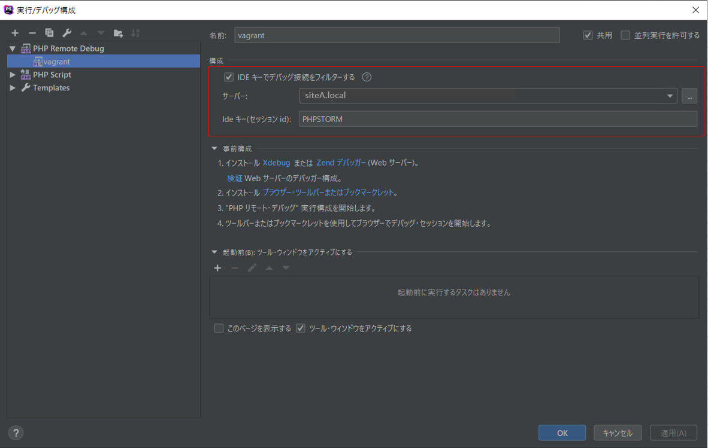
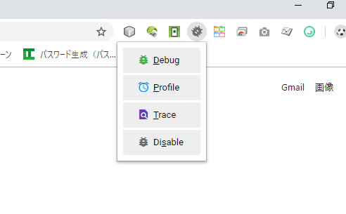

# Vagrant

## アーキテクト
---


## 環境構築手順
---

VirtualBoxをインストール

```
https://www.virtualbox.org/wiki/Download_Old_Builds_5_2
ver. 5.2.28
```

Vagrantをインストール

```
https://www.vagrantup.com/downloads.html
ver2.2.4 (2019/05/17 latest)
```

VagrantにVirtualBoxのaddional管理プラグインをインストール

```
vagrant plugin install vagrant-vbguest
```

Vagrantにvmのイメージファイル(box)をインポート

```
vagrant box add devlocal/1.1 package-php56.box
```

vmを管理するディレクトリを用意

```
cd path/to/vagrant-managed.d
mkdir devlocal.d
```

> 管理ディレクトリ構成

```
- Vagrantfile・・・起動用のコンフィグファイル
+ www・・・開発ディレクトリ（vmの/var/wwwにマウント）
 - siteA 
 - siteB
```

vmを立ち上げる
```
cd path/to/devloca.d
vagrant up
```

sshでvmにログイン
```
cd path/to/devloca.d
vagrant ssh
```

## box運用
---

vmの環境設定を更新した場合はboxに固めて配布

```
cd path/to/devlocal.d
# vmシャットダウン
vagrant halt
# box化→./package.box
vagrant package 
```

```
vmのユーザ
vagrant:vagrant
root:vagrant
```

## コマンド
---

vm起動
```
cd path/to/devlocal.d
vagrant up
```

vmシャットダウン
```
cd path/to/devlocal.d
vagrant halt
```

ボックスインポート
```
vagrant box add ボックス管理名 インポートするボックスファイル
```

インストール済のボックスリスト
```
vagrant box list
```

ssh接続
```
cd path/to/devlocal.d
vagrant ssh
```

鍵の場所
```
vagrant ssh-config
```

## sftpの設定
---

```
  HostName 127.0.0.1
  User vagrant
  Port 2222
  UserKnownHostsFile /dev/null
  StrictHostKeyChecking no
  PasswordAuthentication no
  IdentityFile C:/Users/{ユーザ}/.vagrant.d/insecure_private_key
  IdentitiesOnly yes
  LogLevel FATAL
```

## xdebugの設定
---

> https://qiita.com/taniai-lvgs/items/8e9eba112d2d0ed2530f

```
su root

# xdebugのインストール
yum install -y php56-php-pecl-xdebug.x86_64

# xdebug設定
vi /etc/php.d/xdebug.ini
zend_extension=/opt/remi/php56/root/usr/lib64/php/modules/xdebug.so
html_errors=on
xdebug.default_enable=1
xdebug.remote_autostart=1
xdebug.remote_enable=1
xdebug.remote_handler=dbgp
xdebug.remote_host=192.168.33.1
xdebug.remote_port=9001
xdebug.remote_connect_back=1 
xdebug.max_nesting_level=10000
xdebug.idekey=PHPSTORM

# remote_connect_back について
# この変数が設定されると、remote_hostの設定は自動的に無視される。
# マルチクライアント向けの設定である。

# apache再起動
service httpd restart

# ブラウザのエクステンションorブックマークレットインストール
https://www.jetbrains.com/help/phpstorm/browser-debugging-extensions.html

```

### phpstorm設定例

リモート先サーバー設定


デバッグ設定


実行/デバッグ構成


ブラウザでアタッチ


デバッグ開始
